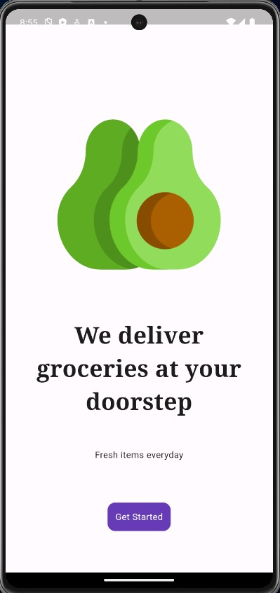

# GROCER
Grocer is a user-friendly flutter based application that lets you effortlessly select and purchase groceries online.


##  TABLE OF CONTENTS

- [Installation](#installation)
- [Screenshots](#screenshots)
- [Credits](#credits)

## INSTALLATION

```bash
git clone https://github.com/AmanKRoy/Grocer
cd GROCERY_APP
flutter pub get
```

## SCREENSHOTS

### MAIN WINDOW


| Intro Page | Home Bar | Cart |
| --- | --- | --- |
|    |  |  |


## CREDITS

- [FLUTTER](https://flutter.dev/)
- [DART](https://dart.dev/)
- [VS CODE](https://code.visualstudio.com/)
- [MITCH KOKO](https://www.youtube.com/watch?v=yLtpMqvMgdY)

